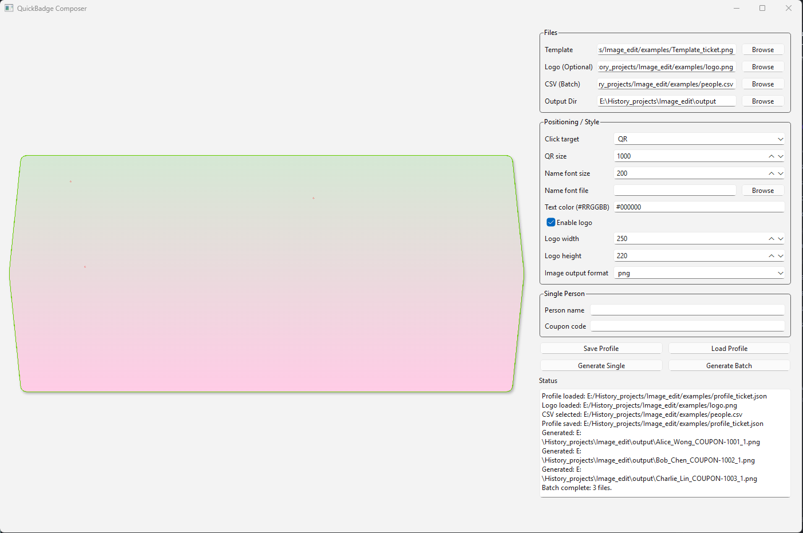

# QuickBadge Composer (Desktop)

Windows desktop app to quickly personalize an image or PDF template by placing:
- QR code (generated from coupon text),
- optional company logo,
- person name text.

Supports:
- single record generation,
- batch generation from CSV.

### Layout:

### Example:

## Quick Start

1. Create and activate a Python 3.10+ environment.
2. Install dependencies:
   - `pip install -r requirements.txt`
3. Run:
   - `python -m app.main`

## CSV Format

Required columns:
- `person_name`
- `coupon_code`

See sample file:
- `examples/people.csv`

## Build EXE (Windows)

Use a clean build environment (recommended):
- `python -m venv .venv_build`
- `.\\.venv_build\\Scripts\\python -m pip install -r requirements.txt`
- `.\\.venv_build\\Scripts\\pyinstaller --noconfirm --onefile --windowed --name QuickBadge_Composer app/main.py`

The executable will be generated in:
- `dist/"QuickBadge_Composer.exe`

